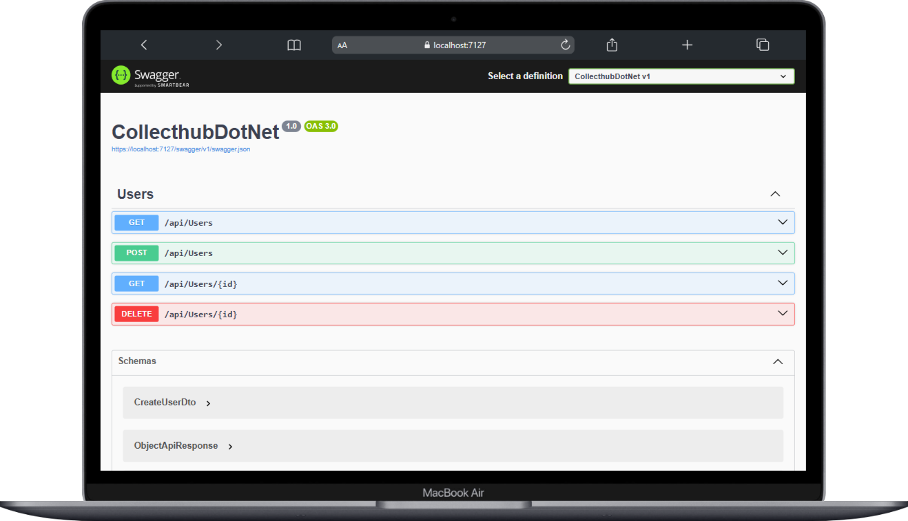
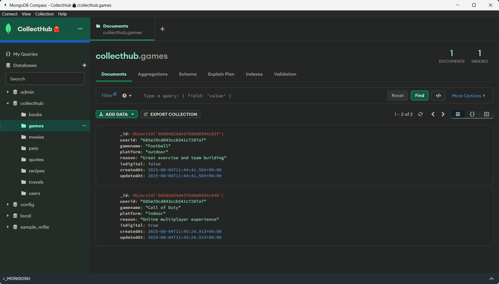
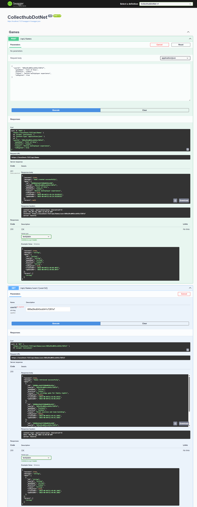
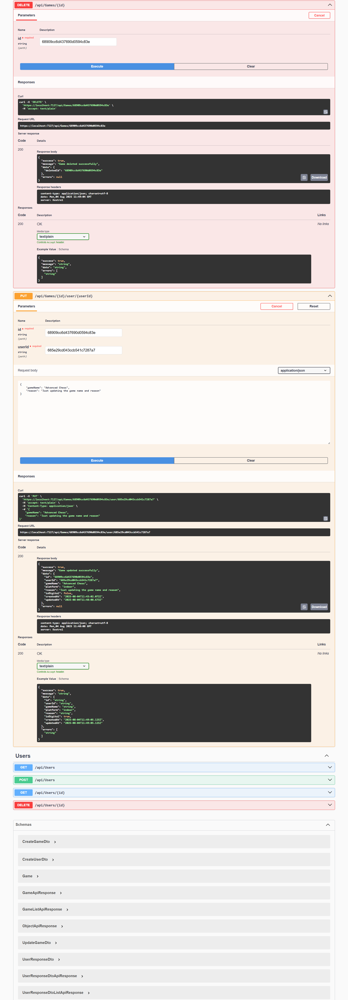

# CollectHub 🎒📃

<div align="center">
  <h2>Your personal collections. All in one place.</h2>
  <p><em>A unified platform to organize and store your personal collections</em></p>
  
  
  
</div>

---

## 🚀 Overview

CollectHub is a comprehensive platform designed to help you organize, manage, and showcase your personal collections in one centralized location. Whether you're collecting games, YouTube channels, programming languages, or any other items, CollectHub provides the tools you need to keep everything organized.


## 📸 Screenshots & API Documentation

### 👥 User Management
<table>
<tr>
<td width="50%">
<h4>User Interface</h4>

</td>
<td width="50%">
<h4>API Response</h4>

</td>
</tr>
</table>

### 🎮 Games Collection
<table>
<tr>
<td width="50%">
<h4>Games API Documentation</h4>

</td>
<td width="50%">
<h4>Game Collections View</h4>

</td>
</tr>
</table>

<table>
<tr>
<td width="50%">
<h4>Games API Documentation - Part 1</h4>

</td>
<td width="50%">
<h4>Games API Documentation - Part 2</h4>

</td>
</tr>
</table>

### 📺 YouTube Channels Collection
<table>
<tr>
<td width="50%">
<h4>YouTube Channels API</h4>

</td>
<td width="50%">
<h4>YouTube Channels Collection</h4>

</td>
</tr>
</table>

<table>
<tr>
<td width="50%">
<h4>YouTube Channels API - Part 1</h4>

</td>
<td width="50%">
<h4>YouTube Channels API - Part 2</h4>

</td>
</tr>
</table>

### 💻 Favorite Programming Languages
<table>
<tr>
<td width="50%">
<h4>Programming Languages API</h4>

</td>
<td width="50%">
<h4>Programming Languages Collection</h4>

</td>
</tr>
</table>

<table>
<tr>
<td width="50%">
<h4>Programming Languages API - Part 1</h4>

</td>
<td width="50%">
<h4>Programming Languages API - Part 2</h4>

</td>
</tr>
</table>

---

### 🏍️🛻 Favorite Vehicles 
<table>
<tr>
<td width="50%">
<h4>Favourite Vehicles  🏎️🚗 API</h4>

</td>
<td width="50%">
<h4>Favourite Vehicles Collection</h4>

</td>
</tr>
</table>

<table>
<tr>
<td width="50%">
<h4>Favourite Vehicles API - Part 1</h4>

</td>
<td width="50%">
<h4>Favourite Vehicles API - Part 2</h4>

</td>
</tr>
</table>


---

## 🛠️ Tech Stack

- **Frontend**: react/next js
- **Backend**: .net8+
- **Database**: MongoDB
- **API**: RESTful API
- **Documentation**: Swagger/OpenAPI

## 🚀 Getting Started


### Installation
```bash
# Clone the repository
git clone https://github.com/kashyapprajapat/CollectHubDotNet.git

# Navigate to project directory
cd CollectHubDotNet

# .NET specific commands
dotnet restore          # Restore NuGet packages
dotnet ef database update  # Update database
dotnet build           # Build solution
dotnet run            # Run application
```

## 📞 Contact

- **Project Link**: [https://github.com/kashyapprajapat/CollectHubDotNet](https://github.com/kashyapprajapat/CollectHubDotNet)
- **Email**: prajapatikashyap14@gmail.com

---

<div align="center">
  <p>Made with ❤️ by Kashyap Prajapati</p>
  <p>⭐ Star this repo if you find it helpful!</p>
</div>